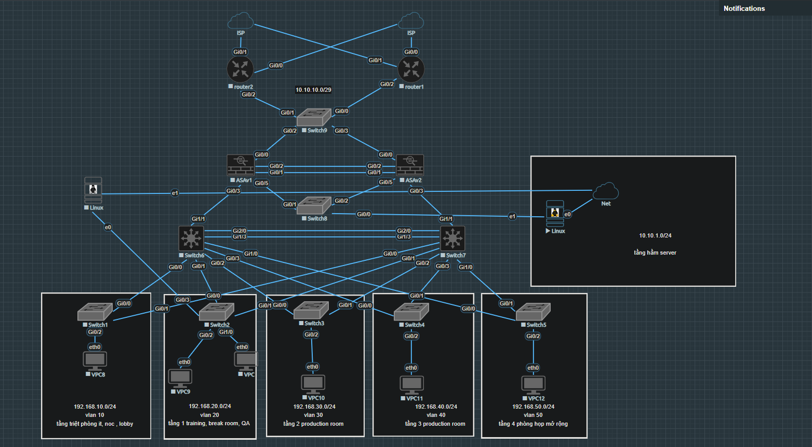
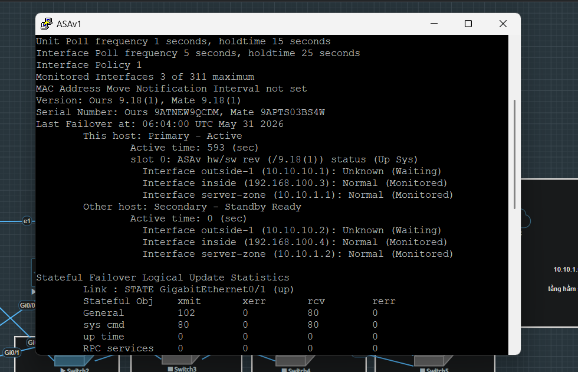
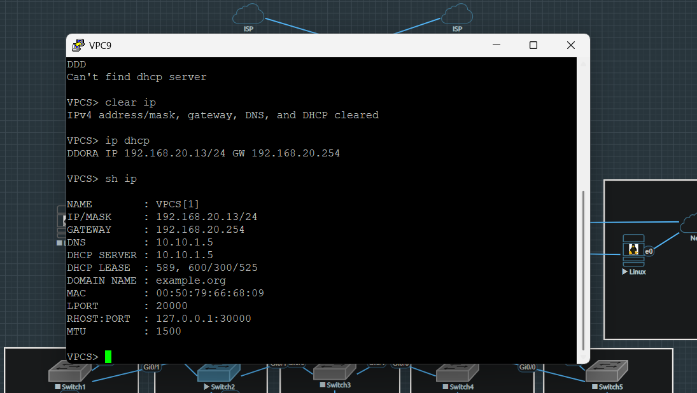
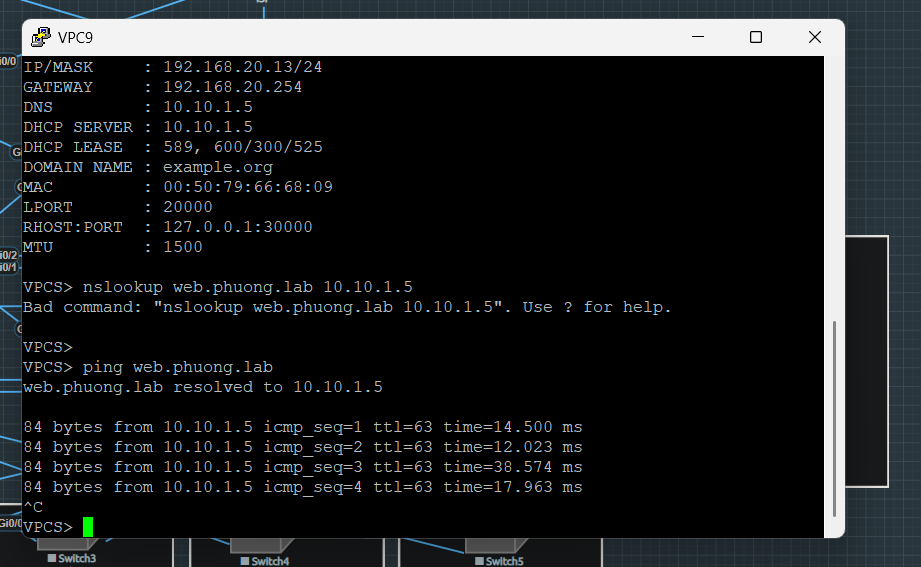
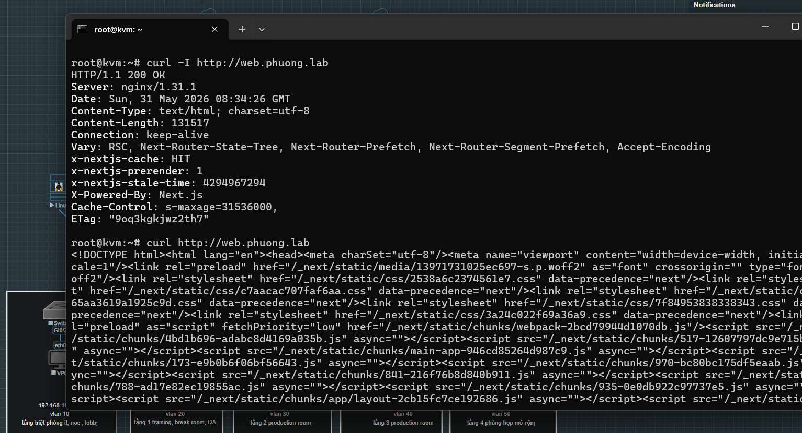

# Enterprise Network Infrastructure Lab

Lab này mô phỏng một hệ thống mạng doanh nghiệp thực tế, bao gồm đầy đủ các thành phần: từ kết nối Internet kép (dual-WAN), tường lửa dự phòng (ASA HA), định tuyến động (OSPF), phân đoạn mạng bằng VLAN cho đến các dịch vụ nội bộ như DHCP, DNS, NTP và Web.

**Mục tiêu của lab:**
- Hiểu được kiến trúc mạng doanh nghiệp nhiều lớp (multi-tier)
- Thực hành cấu hình redundancy ở mọi lớp: WAN, Firewall, L3 Switch
- Nắm vững PBR, OSPF, HSRP, DHCP relay hoạt động xuyên qua Firewall
- Triển khai dịch vụ thực tế (DNS, Web) trên Ubuntu Server

---

## Sơ Đồ Topology



---

## Thiết Kế Địa Chỉ IP & VLAN

### Bảng VLAN

Hệ thống sử dụng 5 VLAN cho các phòng ban, 1 VLAN interconnect giữa Firewall và L3 Switch, và 1 dải riêng cho Server Zone.

| VLAN | Tên / Mục đích | Subnet | HSRP VIP (Default GW) | DHCP Range |
|---|---|---|---|---|
| VLAN 10 | Phòng ban A | 192.168.10.0/24 | 192.168.10.254 | 192.168.10.5 – .253 |
| VLAN 20 | Phòng ban B | 192.168.20.0/24 | 192.168.20.254 | 192.168.20.5 – .253 |
| VLAN 30 | Phòng ban C | 192.168.30.0/24 | 192.168.30.254 | 192.168.30.5 – .253 |
| VLAN 40 | Phòng ban D | 192.168.40.0/24 | 192.168.40.254 | 192.168.40.5 – .253 |
| VLAN 50 | Phòng ban E | 192.168.50.0/24 | 192.168.50.254 | 192.168.50.5 – .253 |
| VLAN 999 | Firewall Interconnect | 192.168.100.0/24 | – | – |
| Server Zone | DNS / DHCP / NTP / Web | 10.10.1.0/24 | – | Static |

### Địa chỉ thiết bị

| Thiết bị | Interface | IP Address | Vai trò |
|---|---|---|---|
| Router1 | Gi0/0 (WAN1) | 192.168.175.223/24 | NAT Outside |
| Router1 | Gi0/1 (WAN2) | 192.168.1.223/24 | NAT Outside |
| Router1 | Gi0/2 (LAN) | 10.10.10.3/29 | NAT Inside, HSRP Active VIP .5 |
| Router2 | Gi0/0 (WAN1) | 192.168.175.222/24 | NAT Outside |
| Router2 | Gi0/1 (WAN2) | 192.168.1.115/24 | NAT Outside |
| Router2 | Gi0/2 (LAN) | 10.10.10.4/29 | NAT Inside, HSRP Standby |
| ASAv1 | Gi0/0 (outside-1) | 10.10.10.1/29 | Primary, Active |
| ASAv2 | Gi0/0 (outside-1) | 10.10.10.2/29 | Secondary, Standby |
| ASAv | Gi0/3.999 (inside) | 192.168.100.3/24 | Failover VIP .4 |
| ASAv | Gi0/5 (server-zone) | 10.10.1.1/24 | Server Zone VIP .2 |
| Switch6 | Vlan10~50 | 192.168.x.1/24 | HSRP Active, priority 110 |
| Switch7 | Vlan10~50 | 192.168.x.2/24 | HSRP Standby |
| Ubuntu | eth0 | 10.10.1.5/24 | DNS + DHCP + NTP + Web |

---

## Lớp WAN – Dual-WAN Failover

### Tổng quan hoạt động

Hệ thống có 2 đường kết nối Internet (ISP-1 và ISP-2). Cả Router1 và Router2 đều kết nối với cả 2 ISP. Traffic được phân phối thông minh theo cơ chế:

- **Policy-Based Routing (PBR)** – quyết định traffic đi ra ISP nào dựa trên ACL
- **IP SLA** – liên tục ping `8.8.8.8` (ISP-1) và `1.1.1.1` (ISP-2) mỗi 5 giây để kiểm tra trạng thái
- **Track Object** – kết nối IP SLA với route-map, tự động loại đường đã chết khỏi routing
- **HSRP** – Router1 là Active (priority 110), Router2 là Standby. VIP `10.10.10.5` là next-hop của ASA

### Giải thích cấu hình Router1

```
! Theo dõi trạng thái ISP-1 bằng cách ping 8.8.8.8
ip sla 1
 icmp-echo 8.8.8.8 source-interface GigabitEthernet0/0
 frequency 5          ! ping mỗi 5 giây
ip sla schedule 1 life forever start-time now

! Track object: nếu ip sla 1 fail  → track 1 = down
track 1 ip sla 1 reachability
 delay down 10 up 5   ! down sau 10s, up sau 5s

! Route-map: traffic từ LAN → ISP-1 nếu track 1 còn up
!                        → ISP-2 nếu track 2 còn up
route-map chia-tai permit 1
 match ip address ACL_TRAFFIC_LAN
 set ip next-hop verify-availability 192.168.175.2 1 track 1
 set ip next-hop verify-availability 192.168.1.1   2 track 2

! Áp dụng PBR lên interface nội bộ (Gi0/2)
interface GigabitEthernet0/2
 ip policy route-map chia-tai
```

>  Khi ISP-1 mất kết nối, ip sla 1 fail → track 1 down → route-map bỏ qua next-hop 192.168.175.2 → toàn bộ traffic tự động chuyển sang ISP-2 .

### NAT Overload cho từng ISP

Mỗi ISP có route-map NAT riêng, đảm bảo traffic ra ISP nào thì được NAT bằng IP của ISP đó:

```
ip nat inside source route-map NAT_WAN1 interface GigabitEthernet0/0 overload
ip nat inside source route-map NAT_WAN2 interface GigabitEthernet0/1 overload

route-map NAT_WAN1 permit 10
 match ip address ACL_TRAFFIC_LAN
 match interface GigabitEthernet0/0   ! chỉ NAT traffic đi ra Gi0/0
```

---

## Lớp Firewall – Cisco ASAv HA 

### Active/Standby Failover

Hai ASAv chạy theo mô hình Active/Standby: ASAv1 xử lý toàn bộ traffic, ASAv2 ở trạng thái standby. Khi ASAv1 gặp sự cố, ASAv2 tiếp quản

| Thành phần | ASAv1 (Primary) | ASAv2 (Secondary) |
|---|---|---|
| Failover role | Primary | Secondary |
| Gi0/1 | STATE link – sync session table | STATE link – sync session table |
| Gi0/2 | LAN failover link (FOCONN) | LAN failover link (FOCONN) |
| FOCONN IP | 172.16.1.1/30 | 172.16.1.2/30 |
| STATE IP | 172.16.2.1/30 | 172.16.2.2/30 |
| outside-1 (Gi0/0) | 10.10.10.1 (Active) | 10.10.10.2 (Standby) |
| inside (Gi0/3.999) | 192.168.100.3 (Active) | 192.168.100.4 (Standby) |
| server-zone (Gi0/5) | 10.10.1.1 (Active) | 10.10.1.2 (Standby) |

```
failover
failover lan unit primary          ! hoặc secondary trên ASAv2
failover lan interface FOCONN GigabitEthernet0/2
failover link STATE GigabitEthernet0/1
failover interface ip FOCONN 172.16.1.1 255.255.255.252 standby 172.16.1.2
failover interface ip STATE  172.16.2.1 255.255.255.252 standby 172.16.2.2
monitor-interface inside           ! monitor interface inside để trigger failover
```


### Chính sách bảo mật (Access Control List)

ASA có 2 interface zone chính và policy khác nhau cho từng zone:

| Zone | Interface | Security Level | Cho phép traffic |
|---|---|---|---|
| outside-1 | Gi0/0 | 0 (thấp nhất) | Chặn mặc định – stateful: return traffic được phép |
| inside | Gi0/3.999 | 100 | DNS, DHCP, NTP, HTTP/S, FTP từ các VLAN nội bộ |
| server-zone | Gi0/5 | 100 | DHCP offer từ server, DNS query ra ngoài, HTTP/S |

```
! Cho phép traffic DNS từ các VLAN qua Firewall đến DNS server
access-list INSIDE-1 extended permit udp any any eq domain
access-list INSIDE-1 extended permit tcp any any eq domain

! Cho phép DHCP relay (bootps = server, bootpc = client)
access-list INSIDE-1 extended permit udp any any eq bootps
access-list INSIDE-1 extended permit udp any any eq bootpc

! Cho phép NTP
access-list INSIDE-1 extended permit udp any any eq ntp

! Cho phép web traffic
access-list INSIDE-1 extended permit tcp any any eq www
access-list INSIDE-1 extended permit tcp any any eq https

! Server zone: cho phép DHCP server gửi offer về các VLAN
access-list SERVER extended permit udp host 10.10.1.5 eq bootps 192.168.0.0 255.255.0.0 eq bootpc
```

> NOTE: Các rule bên dưới đang sử dụng "any" cho đích đến để tối ưu hóa thời gian triển khai và kiểm thử kết nối trong phạm vi Lab (Connectivity-first approach).


## Lớp Distribution – L3 Switch & Inter-VLAN Routing

### HSRP trên L3 Switch

Switch6 và Switch7 cùng chạy HSRP cho mỗi VLAN, cung cấp gateway ảo (VIP) `.254` cho client. Switch6 là Active (priority 110) cho tất cả VLAN:

```
! Trên Switch6 (Active, priority 110):
interface Vlan10
 ip address 192.168.10.1 255.255.255.0
 ip helper-address 10.10.1.5      ! DHCP relay đến Ubuntu server
 standby 1 ip 192.168.10.254      ! VIP – đây là default gateway của client
 standby 1 priority 110           ! cao hơn default (100) → thắng election
 standby 1 preempt                ! tự động lấy lại Active nếu recover
 ip policy route-map FORWARD_TO_FW ! PBR: đẩy traffic qua Firewall

! Trên Switch7 (Standby, priority mặc định 100):
interface Vlan10
 ip address 192.168.10.2 255.255.255.0
 ip helper-address 10.10.1.5
 standby 1 ip 192.168.10.254      ! cùng VIP
 standby 1 preempt
```

### Policy-Based Routing – Buộc traffic qua Firewall

Tất cả traffic từ các VLAN đều phải đi qua ASA Firewall trước khi ra Internet. PBR được áp dụng trên mỗi SVI để đảm bảo điều này:

```
! ACL: match tất cả traffic từ các VLAN nội bộ
ip access-list extended PBR_TO_FIREWALL
 permit ip 192.168.10.0 0.0.0.255 any
 permit ip 192.168.20.0 0.0.0.255 any
 permit ip 192.168.30.0 0.0.0.255 any
 permit ip 192.168.40.0 0.0.0.255 any
 permit ip 192.168.50.0 0.0.0.255 any

! Route-map: đẩy traffic đến inside IP của ASA (192.168.100.3)
route-map FORWARD_TO_FW permit 10
 match ip address PBR_TO_FIREWALL
 set ip next-hop 192.168.100.3
```

### OSPF – Định tuyến động

Tất cả thiết bị L3 tham gia OSPF Area 0, tự động học route của nhau:

| Thiết bị | Router-ID | Network quảng bá |
|---|---|---|
| ASAv1/2 | 1.1.1.1 | 10.10.10.0/24, 192.168.100.0/24 |
| Router1 | 5.5.5.5 | 10.10.10.0/29 |
| Router2 | 7.7.7.7 | 10.10.10.0/29 |
| Switch6 | 3.3.3.3 | 192.168.10-50.0/24, 192.168.100.0/24 |
| Switch7 | 4.4.4.4 | 192.168.10-50.0/24, 192.168.100.0/24 |

---

## Dịch Vụ Mạng – Ubuntu Server (10.10.1.5)

### DHCP Server (ISC-DHCP)

Ubuntu cấp phát IP động cho tất cả 5 VLAN. Các L3 Switch dùng `ip helper-address` để relay gói DHCP qua Firewall đến server:

```
# /etc/dhcp/dhcpd.conf – ví dụ cho VLAN 10
subnet 192.168.10.0 netmask 255.255.255.0 {
  range 192.168.10.5 192.168.10.253;
  option routers 192.168.10.254;       # default gateway = HSRP VIP
  option subnet-mask 255.255.255.0;
  option ntp-servers 10.10.1.5;        # NTP server
}
```

**Luồng DHCP Discovery (trường hợp Switch6 relay):**
1. Client broadcast DHCP Discover → Switch6 nhận
2. Switch6 thêm Option 82 và unicast đến `10.10.1.5` (ip helper-address)
3. Gói đi qua ASA Firewall → ASA phải có rule permit udp bootps/bootpc
4. Server trả về DHCP Offer → Switch6 broadcast về client



### DNS Server (BIND9)

BIND9 giải quyết tên miền nội bộ `phuong.lab` và forward các query khác ra Internet:

```
# /etc/bind/zones/db.phuong.lab
ns1  IN A 10.10.1.5
web  IN A 10.10.1.5    # web.phuong.lab trỏ về Ubuntu server
www  IN A 10.10.1.5    # www.phuong.lab trỏ về Ubuntu server

# Chỉ cho phép các subnet nội bộ query DNS (named.conf.options)
acl trusted {
  192.168.10.0/24;  192.168.20.0/24;  192.168.30.0/24;
  192.168.40.0/24;  192.168.50.0/24;  10.10.1.5;
};

# Forward query không giải quyết được ra Internet
forwarders { 1.1.1.1; 8.8.8.8; 8.8.4.4; };
forward only;
```




### NTP Server

Ubuntu server đồng bộ thời gian cho toàn bộ thiết bị trong mạng. Client trỏ về `10.10.1.5`:

```
# /etc/systemd/timesyncd.conf
[Time]
NTP=10.10.1.5
```
### UFW Firewall (Ubuntu)

Ubuntu server bật UFW với default policy **deny incoming** — chỉ mở đúng các port cần thiết:

| Port | Protocol | Dịch vụ |
|---|---|---|
| 53 (Bind9) | TCP/UDP | DNS |
| 67 | UDP | DHCP Server |
| 80 | TCP | Web (Nginx) |
| 123 | UDP | NTP |
| 22 | TCP | SSH quản trị |

```
Default policy: deny incoming, allow outgoing — chỉ mở đúng port cần thiết.
```

### Web Service (Docker + Nginx)

Web application được container hóa bằng Docker. Nginx đóng vai trò reverse proxy:

```yaml
# docker-compose.yml
services:
  frontend:
    image: phuongbt3232/inmutible-cloud-frontend:lastest
    ports: ["3000:3000"]
  nginx:
    image: nginx:alpine
    ports: ["80:80"]
```

```
# nginx.conf – reverse proxy
location /api/ {
  proxy_pass http://192.168.1.100:3001;  # backend API
}
location / {
  proxy_pass http://frontend:3000;       # React frontend
}
```
### Troubleshooting – Các lỗi thường gặp

| Triệu chứng | Nguyên nhân hay gặp | Cách debug |
| :--- | :--- | :--- |
| **Ping không đến IP đích** | Mất kết nối Layer 2/3, sai gateway, hoặc bị chặn bởi ACL | Dùng `traceroute` kiểm tra hop, sử dụng **Wireshark** phân tích gói tin (ICMP Request/Reply) để xác định điểm rơi gói tin. |
| **Gói tin bị Firewall Drop** | ACL thiếu rule cho phép (Implicit Deny), hoặc Interface đang ở trạng thái Down/Admin Down | `show log` (trên ASA), `show access-list` kiểm tra hit-count, kiểm tra interface bằng `show interface ip brief`. |
| **Client không nhận IP** | ASA block DHCP relay (bootps/bootpc) hoặc cấu hình `ip helper-address` sai | `show access-list SERVER \| include bootps`, kiểm tra `ping 10.10.1.5` từ SVI. |
| **OSPF neighbor không lên** | Sai wildcard mask, hello/dead timer khác nhau, MTU mismatch | `show ip ospf neighbor`, `show ip ospf interface`. |
| **ASA failover không hoạt động** | Sai IP trên failover link, interface monitor đang bị shutdown | `show failover`, `show failover interface`. |
| **Traffic không qua Firewall** | PBR route-map chưa được áp lên SVI hoặc next-hop không khả dụng | `show route-map`, `debug ip policy`. |
| **DNS không phân giải** | Client dùng sai DNS server, service BIND9 chưa restart/cấu hình zone sai | `nslookup web.phuong.lab 10.10.1.5`, `journalctl -u bind9`. |
